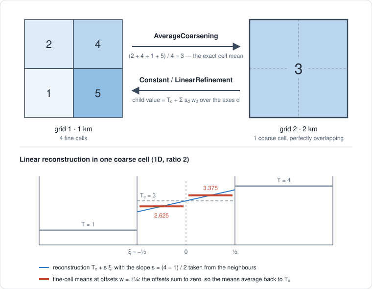

```@meta
CurrentModule = KryosTools
```

# Dyadic regridding

## Concept

Coupled Kryos modules often run at different resolutions — an ice sheet at 1 km, isostasy
at 2 km, a surface model at 4 km — and exchange fields every time step. KryosTools moves
fields between such grids **conservatively**, without allocating temporaries, on CPUs and
GPUs.

It relies on the grids being **dyadic**:

- each grid is regular and isotropic (`dx == dy`), described by a [`DyadicGrid`](@ref)
  built from the cell-centre coordinates a module already has;
- two grids are paired when their spacings differ by a **power of 2** and their corners
  coincide.

Every coarse cell then contains a whole number of fine cells with perfect overlap, as in the
sketch below: nothing needs to be interpolated between arbitrary points, and no weights or
index lists need to be stored. Note that "all resolutions are multiples of 500 m" is not
enough — 1.5 km and 2 km cells do not nest.



The two directions are not symmetric.

- **Coarsening** ([`AverageCoarsening`](@ref)) assigns each coarse cell the mean of the fine
  cells it contains. This is the exact cell integral, so there is nothing to choose. An
  optional weight — typically the true cell area on a distorted projection, or a mask —
  turns it into a weighted mean that conserves `Σ wᵢxᵢ`.
- **Refinement** has to reconstruct sub-cell detail, which is a modelling choice.
  [`ConstantRefinement`](@ref) copies the coarse value into every fine cell.
  [`LinearRefinement`](@ref) reconstructs `T_c + Σ_d s_d ξ_d` within each coarse cell, with
  slopes `s_d` from the neighbouring cells, and gives each fine cell the mean of that
  reconstruction.

**Refinement is conservative whatever the slopes are.** The offset of child `j` of `r`
from its parent's centre is `w_j = (2j − 1 − r) / 2r`, and these offsets sum to zero. The
fine values therefore always average back to `T_c`, as the lower part of the sketch shows.
Coarsening a refined field returns the original exactly. A slope limiter
([`MinModLimiter`](@ref)) can hence bound overshoot — for instance to avoid negative
thickness next to an ice margin — without affecting conservation, although it makes the
operator non-linear.

In the outermost coarse cells the neighbour needed for a centred slope is missing, so the
slope along that axis is zero there and `LinearRefinement` falls back to copying.

When two modules share a grid, [`IdentityRegridding`](@ref) makes the exchange a plain copy.

A coupler usually needs both directions between two grids, which is what
[`BidirectionalRegridding`](@ref) provides. It picks the right one-way regridder for each
direction from the grids, and chooses the direction of each call from the sizes of the two
fields.

```
AbstractRegridding
├── AbstractCoarsening
│   └── AverageCoarsening
├── AbstractRefinement
│   ├── ConstantRefinement
│   └── LinearRefinement
├── IdentityRegridding
└── BidirectionalRegridding
```

A few practical points:

- Regridders are built once, at setup. Their concrete types depend on the grids, so store
  them in parametric fields; [`regrid!`](@ref) itself is type-stable and does not allocate
  memory proportional to the fields. KernelAbstractions adds a small constant overhead per
  call on the CPU.
- One regridder serves fields of any floating-point type. `Float16` fields are accumulated
  in `Float32`.
- On GPUs, `regrid!` is asynchronous like any KernelAbstractions kernel. GPU and CPU results
  agree to rounding: the GPU compiler may fuse multiply-add operations.

## Example

Two grids covering the same 8 km × 8 km domain, at 1 km and 2 km:

```jldoctest regridding
julia> using KryosTools

julia> x1 = 500.0:1000.0:7500.0;  # cell centres at 1 km

julia> x2 = 1000.0:2000.0:7000.0; # cell centres at 2 km

julia> g1, g2 = DyadicGrid(x1, x1), DyadicGrid(x2, x2);

julia> rgd = BidirectionalRegridding(g1, g2)
BidirectionalRegridding(8×8 ↔ 4×4: to1 = LinearRefinement, to2 = AverageCoarsening)
```

Refine a field from grid 2 onto grid 1. Along each axis, the interior coarse cells get
linear profiles, while the outermost ones are copied:

```jldoctest regridding
julia> h2 = [100.0 * i for i in 1:4, j in 1:4];

julia> h1 = zeros(8, 8);

julia> regrid!(h1, h2, rgd);

julia> h1[:, 1]
8-element Vector{Float64}:
 100.0
 100.0
 175.0
 225.0
 275.0
 325.0
 400.0
 400.0
```

The refinement is conservative, and coarsening it back returns the original field:

```jldoctest regridding
julia> sum(h1) == 4 * sum(h2)
true

julia> regrid(h1, rgd) == h2
true
```
